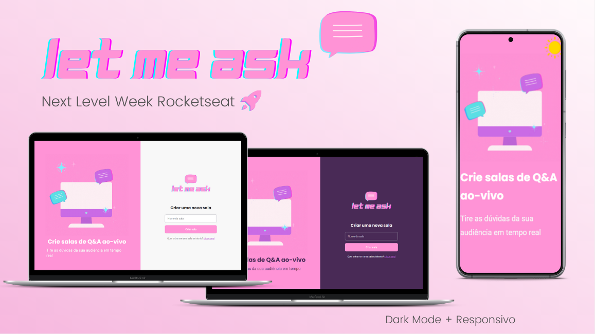

  

# Letmeask - em desenvolvimento :construction:

Aplicação web para compartilhamento, classificação (baseada na quantidade de likes) e destaque de perguntas! :sparkles:

Desenvolvido durante a <strong>6° NLW da Rocketseat </strong> :rocket:

<strong>Como funciona? </strong>
Crie uma sala para receber perguntas. Ao criar, um código será gerado e você poderá compartilhá-lo para que outras pessoas possam entrar na sala e mandar perguntas.
 

### :computer: Technology Stack:
- React.js
- TypeScript
- Firebase
- Sass
 

### Conteúdos abordados:

#### Dia 01
- Fluxo de uma SPA
- Conceitos do React - componente, propriedade, estado
- Explicação do fluxo da aplicação

#### Dia 02
- Estilização de páginas
- Funcionamento da navegação - roteamento
- Autenticação com firebase
- Contexto dentro do React - contrução de uma Context API para autenticação
- Utilização do useEffect

#### Dia 03
- Fluxo de criação e acesso das salas - criar referência, inserir, buscar no firebase
- Criar regras no Realtime Database 
- Formulários no React
- Eventos do Firebase

#### Adicionais TODO
- [ ] dark mode
- [ ] responsivo
- [ ] erros/alertas, sugestão: react hot toast